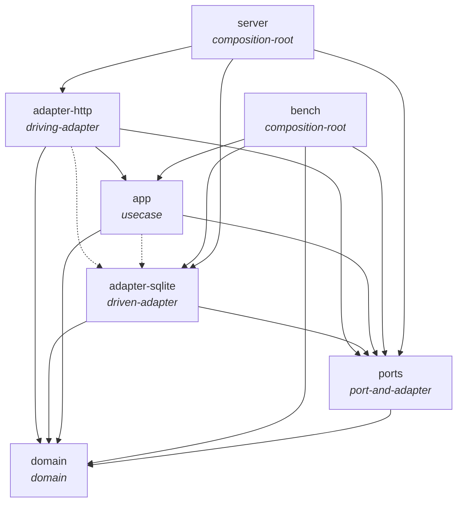

# Crate graph

Generated by `just views` from `cargo metadata`. An arrow points from a crate to one it depends on;
a dotted arrow is a dev-dependency.

```mermaid
graph TD
    adapter_http["adapter-http<br/><i>driving-adapter</i>"]
    adapter_sqlite["adapter-sqlite<br/><i>driven-adapter</i>"]
    app["app<br/><i>usecase</i>"]
    bench["bench<br/><i>composition-root</i>"]
    domain["domain<br/><i>domain</i>"]
    ports["ports<br/><i>port-and-adapter</i>"]
    server["server<br/><i>composition-root</i>"]
    adapter_http -.-> adapter_sqlite
    adapter_http --> app
    adapter_http --> domain
    adapter_http --> ports
    adapter_sqlite --> domain
    adapter_sqlite --> ports
    app -.-> adapter_sqlite
    app --> domain
    app --> ports
    bench --> adapter_sqlite
    bench --> app
    bench --> domain
    bench --> ports
    ports --> domain
    server --> adapter_http
    server --> adapter_sqlite
    server --> ports
```
